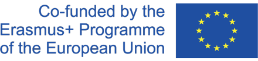

# References
- <b>E.M. Bender and A. Lascarides</b>: Linguistic Fundamental for Natural Language Processing: 100
- <b>Essentials from Semantics and Pragmatics</b>: Morgan & Claypool Publishers, 2019
- <b>Vajjala and B. Majumder</b>: Practical natural Language Processing, O'Reilly, 2020
- <b>Jurafsky, J. M. Martin</b>: Speech and Language Processing, Third Edition, Pearson International, 2019
- <b>M. Nugues</b>: Language Processing with Perl and Prolog, Second Edition, Springer Verlag, 2014
- <b>Carnie</b>: Syntax: A Generative Introduction, Third Edition, Wiley-Blackwell, 2013
- <b>Steedman</b>: The Syntactic Process, MIT press, 2001
- <b>Steedman</b>: Surface Structure and Interpretation, MIT press, 1996
- <b>Bramer</b>: Logic Programming with Prolog, Second edition, Springer Verlag, 2013
- <b>Blackburn, J. Bos</b>: Representation and Inference for Natural Language, CSLI Publication, 2008

# Resources
- <b>Wordnet</b>: https://wordnet.princeton.edu/
    - A Lexical Database for English.
- <b>Verbnet</b>: https://verbs.colorado.edu/verb-index/vn3.3/
    - The largest on-line network of English verbs that links their syntactic and semantic patterns.
- <b>Framenet</b>: https://verbs.colorado.edu/verb-index/vn3.3/
    - A lexical database of English that is both human- and machine-readable, based on annotating examples of how words are used in actual texts.
- <b>Propbank</b>: https://verbs.colorado.edu/verb-index/vn3.3/
    - Corpus that is annotated with verbal propositions and their arguments
- <b>Stanford CoreNLP</b>: https://stanfordnlp.github.io/CoreNLP/
    - A set of natural language analysis tools written in Java
- <b>AllenNLP</b>: https://allennlp.org/
    - A free, open-source natural language processing platform for building state of the art models.
    
  [DSAI Logo](DSAI_logo.png)
